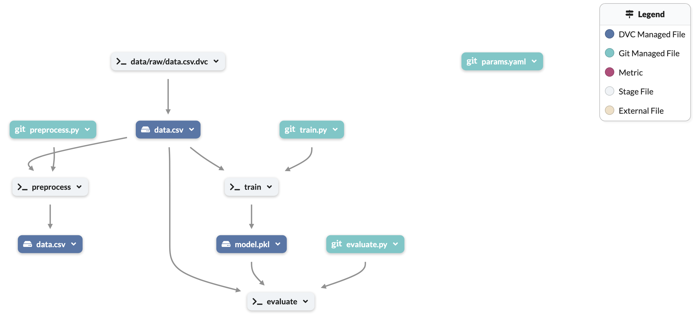

# DVC-MLflow-Dagshub Pipeline Project

This project demonstrates an end-to-end machine learning pipeline using DVC (Data Version Control) for data and model versioning and MLflow for experiment tracking. The pipeline focuses on training a Random Forest Classifier on the Pima Indians Diabetes Dataset, with well-defined stages for data preprocessing, model training, and evaluation.

## Key Features

### Data Version Control (DVC)
- **DVC** is used to track and version datasets, models, and pipeline stages, ensuring reproducibility across different environments.
- The pipeline is structured into stages (preprocessing, training, evaluation) that automatically re-execute if any dependencies change (e.g., data, scripts, or parameters).
- DVC supports remote data storage (e.g., DagsHub, S3) for handling large datasets and models efficiently.

### Experiment Tracking with MLflow
- **MLflow** is used to track experiment metrics, parameters, and artifacts.
- Logs hyperparameters of the model (e.g., `n_estimators`, `max_depth`) and performance metrics like accuracy.
- Helps in comparing different runs and models, optimizing the machine learning pipeline.

## Project Structure

```
data
├── processed
│   └── data.csv
└── raw
    └── data.csv
src
├── __init__.py
├── evaluate.py
├── preprocess.py
├── train.py
.gitignore
dvc.yaml
params.yaml
.env
README.md
requirements.txt
```

## Environment Variables and Secure Credential Handling

A `.env` file is used to securely store sensitive information, such as DagsHub credentials, access keys, and MLflow tracking URIs. This file is included in `.gitignore` to prevent it from being tracked in Git.

### `.env` File Structure:

```
access_key_id=<your_access_key_id>
secret_access_key=<your_secret_access_key>
REPO_OWNER=<dagshub_username>
MLFLOW_TRACKING_URI=<dagshub_mlflow_tracking_url>
MLFLOW_TRACKING_PASSWORD=<dagshub_mlflow_tracking_password>
```

> **Note:** Use the `python-dotenv` library to load these variables safely into your application.

## Step-by-Step Guide

### Step 1: Install Required Packages

Ensure you have the dependencies from `requirements.txt`:

```bash
pip install -r requirements.txt
```

### Step 2: Initialize Git and DVC

1. Initialize Git:
   ```bash
   git init
   ```
   
2. Initialize DVC:
   ```bash
   dvc init
   ```

### Step 3: Configure DVC Remote Storage

1. Add a DVC remote storage:
   ```bash
   dvc remote add -d dagshub_remote <dagshub_repo_url>
   ```
   
2. DVC will use credentials from the `.env` file for secure access to DagsHub.

### Step 4: Track Raw Data with DVC

1. Add the raw data to DVC tracking:
   ```bash
   dvc add data/raw/data.csv
   ```
2. This will create a `.dvc` file for the raw data, which will be tracked by DVC.

3. Commit the changes to Git:
   ```bash
   git add data/raw/data.csv.dvc .gitignore
   git commit -m "Add raw data with DVC tracking"
   ```

### Step 5: Define DVC Stages in `dvc.yaml`

#### Preprocessing Stage

```bash
dvc stage add -n preprocess \
    -p preprocess.input,preprocess.output \
    -d src/preprocess.py -d data/raw/data.csv \
    -o data/processed/data.csv \
    python src/preprocess.py
```

#### Training Stage

```bash
dvc stage add -n train \
    -p train.data,train.model,train.random_state,train.n_estimators,train.max_depth \
    -d src/train.py -d data/processed/data.csv \
    -o models/model.pkl \
    python src/train.py
```

#### Evaluation Stage

```bash
dvc stage add -n evaluate \
    -d src/evaluate.py -d models/model.pkl -d data/processed/data.csv \
    python src/evaluate.py
```

Commit the updated `dvc.yaml` and `params.yaml` files:
```bash
git add dvc.yaml params.yaml
git commit -m "Define pipeline stages in dvc.yaml"
```

### Step 6: Run the Pipeline

Execute the entire pipeline with:
```bash
dvc repro
```

This command will run each stage, re-executing only the necessary steps if any dependencies have changed.

### Step 7: Tracking Experiments with MLflow

1. Start the MLflow tracking server:
   ```bash
   mlflow ui
   ```

2. Use MLflow to log model parameters and performance metrics for easy comparison across multiple runs.

### Step 8: Push Data to DVC Remote Storage

1. Push data and model files to DagsHub:
   ```bash
   dvc push
   ```

2. Commit all changes to Git:
   ```bash
   git add .
   git commit -m "Push data to DagsHub and track experiments"
   ```

3. Push to GitHub:
   ```bash
   git push origin main
   ```


#### After that you will see this pipeline graph in Dagshub:



## Technology Stack

- **Python**: Core programming language for data processing, model training, and evaluation.
- **DVC**: For version control of data, models, and pipeline stages.
- **MLflow**: For logging and tracking experiments, metrics, and model artifacts.
- **Scikit-learn**: Used for building and training the Random Forest Classifier.
- **Dotenv**: Loads environment variables from the `.env` file for secure credential management.

