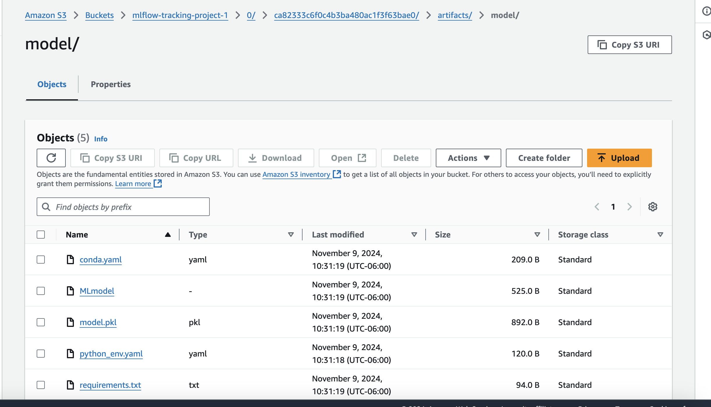
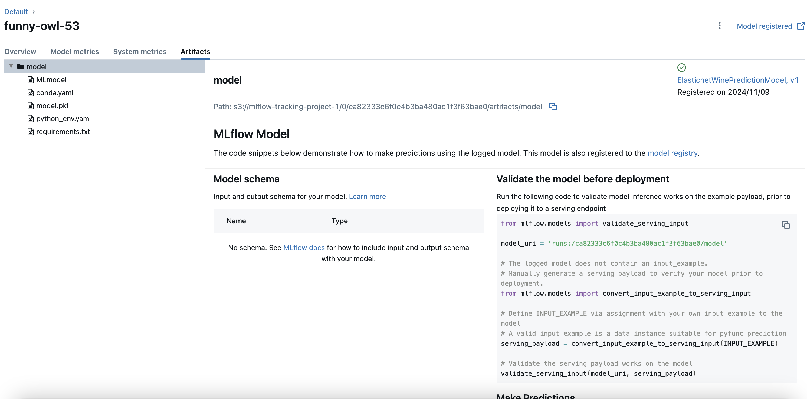

# MLflow on AWS

This guide provides a step-by-step approach to setting up an MLflow tracking server on AWS using an S3 bucket to store artifacts and an EC2 instance to host the server. This setup enables centralized experiment tracking and artifact storage, which is essential for MLOps workflows.

## Overview

MLflow is an open-source platform to manage the machine learning lifecycle, including experimentation, reproducibility, and deployment. By setting up MLflow on AWS, we leverage AWS's storage and compute services to make MLflow accessible remotely, allowing for scalable and reliable experiment tracking.


# Project Directory Structure

The project directory is organized as follows:

```
data/
├── winequality.csv          # Dataset file used in the project

.gitignore                       # File to ignore specific files/folders in version control
app.py                           # Main application script for ML training and tracking
README.md                        # Documentation file for the project
requirements.txt                 # Dependencies required to run the project
```

- **`data/winequality.csv`**: The dataset used for training and testing the model.
- **`.gitignore`**: Specifies files and directories to be ignored by Git.
- **`app.py`**: The main application file for setting up MLflow, data processing, model training, and tracking.
- **`README.md`**: Documentation and setup instructions for the project.
- **`requirements.txt`**: Lists all required Python packages to install for running the project.


## Prerequisites

- An AWS account
- Basic understanding of AWS services (S3 and EC2)
- AWS CLI installed and configured on your local machine
- Python installed on both your local and remote environments

## Step-by-Step Setup

### Step 1: Log in to the AWS Console

1. Navigate to the [AWS Management Console](https://aws.amazon.com/console/).
2. Log in with your AWS credentials.

### Step 2: Set up IAM User Access Keys

1. Go to the **IAM** (Identity and Access Management) section.
2. Create a new user (if you don't already have one) with `Programmatic access` enabled.
3. Attach the following policies to the IAM user:
   - `AmazonS3FullAccess` (required for S3 bucket access)
   - `AmazonEC2FullAccess` (optional, for managing EC2 if needed)
4. Save the access key and secret key. You will need these for configuring the AWS CLI.

### Step 3: Install AWS CLI Locally (if not already installed)

1. If you haven’t installed the AWS CLI, follow these steps to install it:

   ```bash
   # For macOS
   brew install awscli

   # For Ubuntu
   sudo apt update
   sudo apt install awscli
   ```

### Step 4: Configure AWS CLI on Your Local Machine

1. Run the following command to configure the AWS CLI with your access keys:

   ```bash
   aws configure
   ```

2. Enter your **AWS Access Key ID**, **Secret Access Key**, **Region**, and output format (default is `json`).

### Step 5: Create an S3 Bucket to Store MLflow Artifacts

1. In the AWS Console, go to the **S3** service.
2. Click on **Create bucket** and give your bucket a unique name (e.g., `my-mlflow-artifacts`).
3. Choose a region close to your EC2 instance (e.g., `us-east-1`).
4. Leave other settings as default and click **Create bucket**.

   > Note: The S3 bucket will serve as the default artifact store for MLflow, where all experiment logs, models, and artifacts will be stored.

### Step 6: Create an EC2 Instance for Hosting MLflow

1. Go to the **EC2** service in the AWS Console.
2. Click **Launch Instance** and follow these steps:
   - Choose an Amazon Machine Image (AMI) like **Ubuntu Server 20.04 LTS**.
   - Select an instance type (e.g., `t2.micro` for testing, `t2.medium` or higher for production).
   - Configure network settings and security group settings as follows:
     - **Inbound Rules**:
       - **HTTP**: Port 80 (for potential web access, optional)
       - **HTTPS**: Port 443 (for secure access, optional)
       - **Custom TCP Rule**: Port 5000 (for MLflow tracking server)
       - **SSH**: Port 22 (for remote access to the instance)
     - Allow all traffic for ports 5000, 80, and 443, if needed.
   - Launch the instance with your preferred key pair.

### Step 7: Connect to Your EC2 Instance

1. Once the EC2 instance is running, connect to it via SSH:
   ```bash
   ssh -i /path/to/your-key.pem ubuntu@<ec2-public-ip>
   ```

### Step 8: Set Up MLflow on the EC2 Instance

1. Update the package lists on the EC2 instance:
   ```bash
   sudo apt update
   ```

2. Install `pip` if it's not already installed:
   ```bash
   sudo apt install python3-pip
   ```

3. Install `pipenv` and `virtualenv` for environment management:
   ```bash
   sudo apt install pipenv
   sudo apt install virtualenv
   ```

4. Set up a directory for the MLflow project:
   ```bash
   mkdir mlflow
   cd mlflow
   ```

5. Create a virtual environment and install dependencies:
   ```bash
   pipenv install mlflow
   pipenv install awscli
   pipenv install boto3
   pipenv shell  # Activate the virtual environment
   ```

### Step 9: Configure AWS CLI on the EC2 Instance

1. Set up AWS credentials on the EC2 instance using `aws configure`:
   ```bash
   aws configure
   ```
   
2. Enter the same **AWS Access Key ID** and **Secret Access Key** you used earlier. This allows the EC2 instance to interact with your S3 bucket.

### Step 10: Start the MLflow Tracking Server on the EC2 Instance

1. Run the MLflow server and specify the S3 bucket as the artifact root:

   ```bash
   mlflow server -h 0.0.0.0 --default-artifact-root s3://<bucket_name> --backend-store-uri sqlite:///mlflow.db
   ```

   - `-h 0.0.0.0`: Binds the server to all IP addresses, making it accessible externally.
   - `--default-artifact-root s3://<bucket_name>`: Sets the S3 bucket as the storage location for artifacts.
   - `--backend-store-uri sqlite:///mlflow.db`: Specifies the SQLite database for storing experiment metadata. For production, consider using a managed database like PostgreSQL or MySQL.

2. Keep the server running. You can use tools like `tmux` or `screen` to run the MLflow server in the background.

### Step 11: Access the MLflow Server

1. Open a web browser and go to `http://<EC2-public-ip>:5000` to access the MLflow UI.
2. You should see the MLflow tracking server interface.

### Step 12: Set Up MLflow Tracking URI Locally

1. On your local machine, set the MLflow tracking URI to the EC2 instance URL:
   ```bash
   export MLFLOW_TRACKING_URI='http://<EC2-public-ip>:5000'
   ```

2. Alternatively, you can set the `MLFLOW_TRACKING_URI` in your code, for example:
   ```python
   import mlflow
   mlflow.set_tracking_uri('http://<EC2-public-ip>:5000')
   ```

3. Now, any MLflow tracking operations you perform locally will be logged to the remote MLflow server on AWS.

***After running successfully, you will see the following MLflow experiment logs on the S3 bucket and model artifacts through the MLflow UI:***

<div style="display: flex; justify-content: space-between;">
    
    
</div>


## Summary of AWS Configuration Steps

1. **IAM**: Set up an IAM user with appropriate permissions.
2. **S3**: Create an S3 bucket to store MLflow artifacts.
3. **EC2**: Set up an EC2 instance, configure security groups, and install MLflow and dependencies.
4. **MLflow Server**: Start the MLflow server on EC2, pointing to the S3 bucket for artifact storage.
5. **Local Setup**: Configure the tracking URI locally to point to the MLflow server on AWS.

